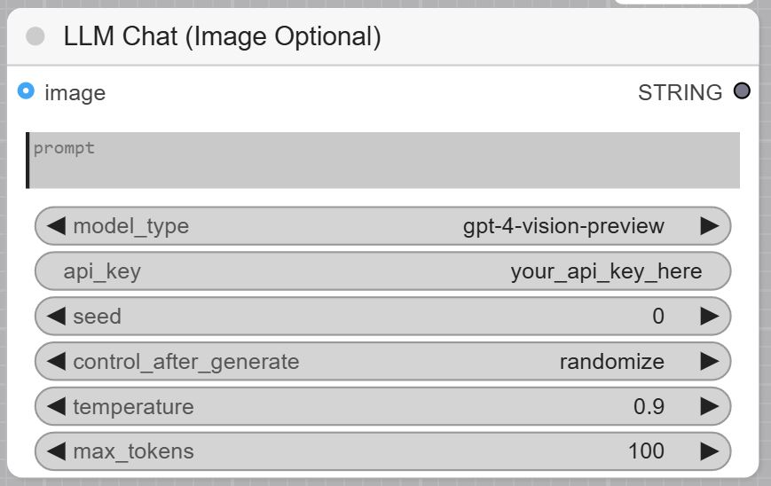
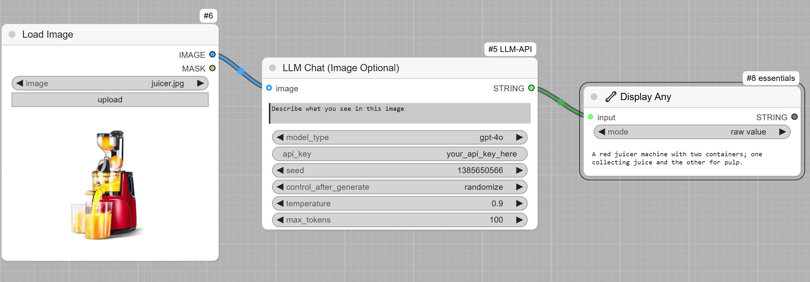

# ComfyUI LLM Chat Node

A custom node for ComfyUI that enables Large Language Model (LLM) chat interactions with optional image input support. This node allows you to interact with various text and vision language models directly within your ComfyUI workflows.  

## Features

- Support for both text-only and vision-enabled language models
- Configurable model parameters (temperature, max tokens)
- Optional image input support
- Adjustable random seed for consistent outputs
- Easy integration with existing ComfyUI workflows

## Installation and Usage

1. Navigate to ComfyUI/custom_nodes folder in terminal or command prompt.
2. Clone the repo using the following command:
   `git clone https://github.com/ComfyUI-Workflow/ComfyUI-OpenAI`
3. Go to `custom_nodes/COMFYUI-LLM-API` and install depedencies by running `pip install -r requirements.txt`
4. Restart ComfyUI

## Example use cases:

